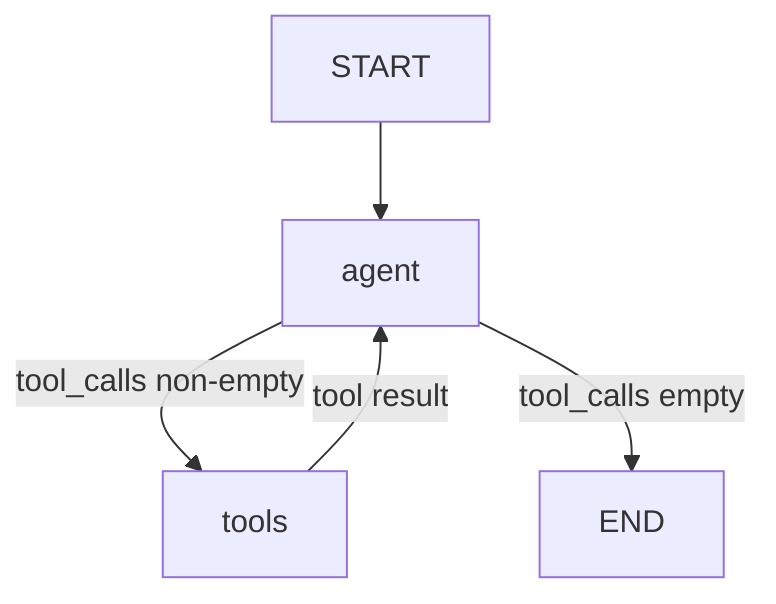
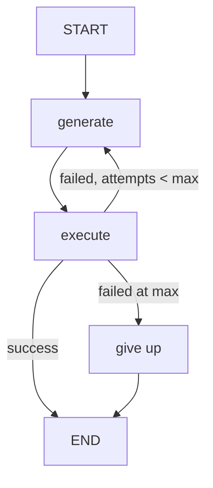
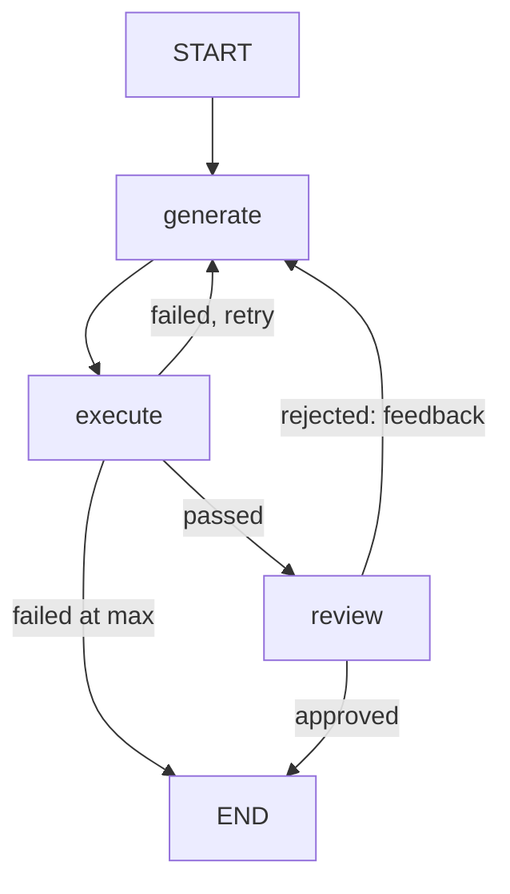
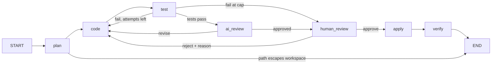
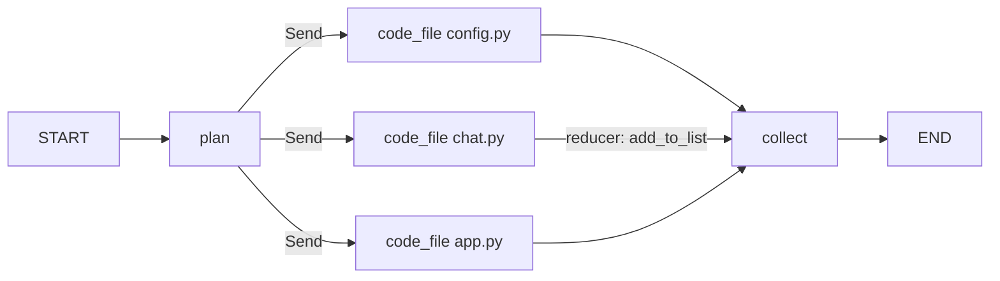

# Teaching drawings

The six drawings the instructor script makes live, one file per beat. Each exists twice: a `.excalidraw` file to open at [excalidraw.com](https://excalidraw.com) (drag it onto the canvas, or use Open from the menu) and an `.svg` for a quick look. Regenerate them with:

```bash
uv run python scripts/build_graphs.py
```

| Beat | File | What it is |
|---|---|---|
| 14 | `beat14_agent_loop` | The first graph: agent, tools, one conditional edge (ch03 C6) |
| 27 | `beat27_self_correcting` | generate, execute, retry, give up, plus the state table to fill row by row (ch09 C13) |
| 30 | `beat30_generate_execute_review` | The reviewer added, plus the second state table (ch10 C19) |
| 44 | `beat44_orchestrator` | plan, code, test, AI review, human review, apply, verify; 7 nodes, 4 routes (ch16 C13) |
| 47 | `beat47_state_table` | The state through one full run of demo-1 |
| 48 | `beat48_parallel` | One coder per file with Send and the reducer (ch17 C20) |

## Two ways to use them live

**Trace.** Open the `.excalidraw` file, set every element's opacity to 20 percent (select all, then the opacity slider), and draw over it in front of the room. The layout is already solved, so you draw at speaking pace.

**Reveal.** Open the file, select all, delete, and redraw freehand while talking; then Undo (Cmd+Z) once to bring the finished drawing back for the trace and the state table. Or keep the finished file in a second tab and switch to it after drawing.

The state tables in beats 27, 30, and 47 are filled in. To fill them live, open the file and delete the cell text before the session; the grid stays.

## Mermaid, for slides or the site










