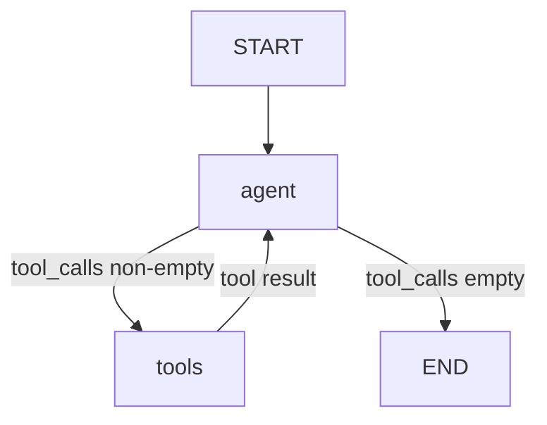
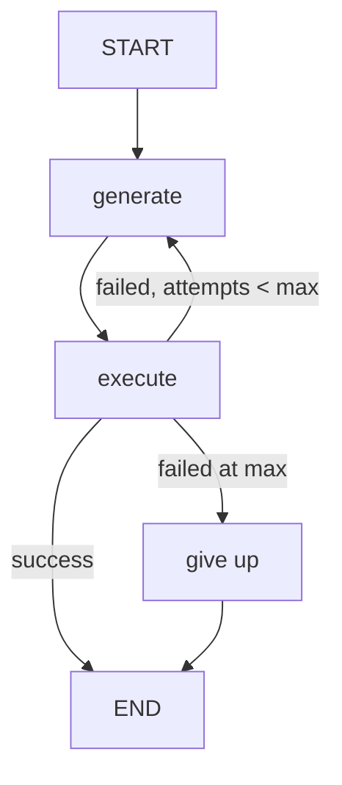
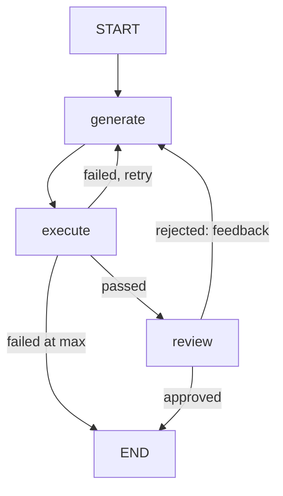
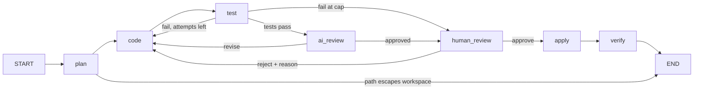
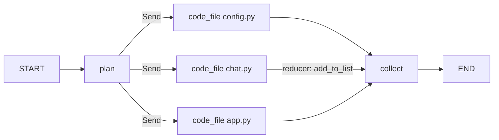

# Teaching drawings

Six drawings, learner-facing. Open an `.svg` in a browser to show it on screen; open the `.excalidraw` at [excalidraw.com](https://excalidraw.com) (drag it onto the canvas) to draw over it or edit it live. Nothing in the files addresses the instructor; the notes for you are below. Regenerate with:

```bash
uv run python scripts/build_graphs.py
```

| File | Shows | Script beat | Lesson cell |
|---|---|---|---|
| `agent_loop` | agent, tools, one conditional edge | 14 | ch03 C6 |
| `self_correction` | generate, execute, retry, give up, and the state after each step | 27 | ch09 C13 |
| `self_correction_with_review` | the reviewer added, and the state after each step | 30 | ch10 C19 |
| `orchestrator` | plan, code, test, AI review, human review, apply, verify; every route labelled | 44 | ch16 C13 |
| `orchestrator_state` | what each field holds after each node of one run | 47 | ch16 C15 to C17 |
| `parallel_coders` | one coder per file with Send and the reducer | 48 | ch17 C20 |

## Showing them

**Show.** Open the `.svg` in a browser tab (Cmd+O, or drag it in). It has a white background and a one-line caption a learner can read. Zoom with Cmd+plus if the room is far away.

**Trace.** Open the `.excalidraw` file, select all, set opacity to 20 percent, and draw over it at speaking pace. The layout is already solved.

**Reveal.** Draw freehand on a blank canvas while talking, then switch to the tab with the finished file for the trace and the state table.

**Fill a table live.** The state tables in `self_correction`, `self_correction_with_review`, and `orchestrator_state` are filled in. Open the `.excalidraw` file, delete the cell text before the session, and type into the cells as the room answers. The grid stays.

## Notes for the instructor, per drawing

**agent_loop.** Two nodes. `agent` runs the model with the tools bound; `tools` is a ToolNode that runs every tool call in the last AI message. The conditional edge is `route()`: tool calls present, go to tools; none, done. Trace "what is Python" (no tool calls) and "list the files" (one tool call) on the drawing before running C6.

**self_correction.** Fill the table row by row and ask before each cell: which fields have values at START? After generate? Is `error` filled after generate? (No: generate cannot run code.) Does generate know the error on attempt 2? (Yes, it is in the prompt.) Say whether attempts count per node or per system: this graph counts per system.

**self_correction_with_review.** Draw both orders for the cost argument: execute then review (the reviewer runs once, on code that works) versus review then execute (three times, twice on code that did not). One shared attempts counter; there is no give-up branch after review.

**orchestrator.** Rapid-fire the routes with the room. At test, passed? AI review. Failed, attempts left? code, with the traceback. Failed at the cap? human review, so the human sees the failures. At AI review, approved? human review. Rejected? code, with the feedback (auto-approve after two). At human review, approve? apply. Reject? code, with my reason, and both counters reset. After apply? verify. After verify? END. The dashed edge from plan is the path check: a planned file outside the workspace ends the run.

**orchestrator_state.** Walk it slowly. The row that matters is the second `code`: v2 was written with reason_1 in the prompt. Then run ch16 N1 for the reject path and show both counters back at 0 / 0.

**parallel_coders.** Same node, three copies, different inputs. `fan_out_to_coders` returns one Send per file task. The reducer on `generated_code` (existing + new) merges the results. It is the only reducer of the day, and `MessagesState` was using one all along.

## Mermaid, for slides or the site










