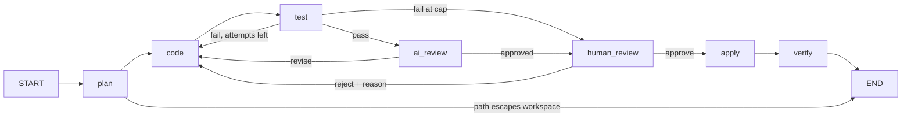

# Teaching guide: Build an AI Coding Agent

**Who this is for.** The instructor delivering Sprint 6, Day 13. You know Python, you have used LangChain, and you have seen LangGraph. You have not necessarily built a coding agent or thought hard about why they are shaped the way they are. Read this once, in one sitting, before the instructor script. The script tells you what to run and say, beat by beat. This guide tells you what you are teaching, why it is in this order, and what a learner is supposed to understand at each step.

**How to use it.** Part 1 builds the mental model in layers. Part 2 maps every lesson chapter onto those layers, so when the script says "ch09 C12" you know which idea that cell carries. Parts 3 to 6 are reference: the design decisions and their reasons, the learner questions that came up and the answers that worked, the connections to the earlier sprints, and a glossary.

---

## Part 0: The one idea

Everything in this session is one graph with more nodes added to it.

The first graph has two nodes. A model decides what to do; a tool does it; the model looks at the result and decides again. That loop is the whole of Cursor's chat, of Claude Code, of Codex. Every later chapter adds a node to that loop or wraps it in another loop: a node that runs the code, a node that reviews it, a node that plans, a node that stops and asks a human, three copies of a node running at once.

If a learner leaves with only one thing, it should be the picture of that loop and the habit of asking, for every new feature, "which node did we add, and which edge did we make conditional?"

The session's second idea is the analogy that carries it. Ishan's words on the day (transcript L218): "Always think of an agent as a human. The first notebook is where we give the human its hands and legs. The second is where we give it the brain to think on its own, reflect on its own, and improve on its own." In his recap he called Lesson 2 "a brain, or more self-awareness" (L3234). This build keeps his split and gives each lesson one word: Lesson 1 gives the agent hands (tools, files, a chat); Lesson 2 gives it self-awareness (it runs its own code, sees the error, fixes it, reviews itself); Lesson 3 is the brain (it searches the codebase, plans, delegates, runs the tests, asks you before it touches disk, and does several files at once). If you prefer Ishan's two-part version, use it; the point is the progression, not the labels.

A third idea is about how to teach it, and Ishan modelled it all day: trim live, say what you trimmed, point at the fuller version. He dropped the execute node from the Lesson 3 graph "because it is already getting complex" (L2781), dropped the give-up branch "to simplify" (L2887), and told the room "we have already done that once" (L2947) when a mechanism repeated. The rebuilt graph keeps those nodes, so you have the opposite option: show the full graph, and when a learner's eyes glaze, say which nodes are the ones they already know.

Ishan also gave every mechanism a name from the design-pattern literature, twice (L2295 at the end of Lesson 2, L3210 at the end of Lesson 3). Use the names; they are what let learners generalise past this one repo.

| Mechanism | Pattern name |
|---|---|
| Model plus tools in a loop (Layer 3) | Agent loop, tool use |
| Generate, execute, review as a pipeline (Layer 6) | Prompt chaining |
| A node that judges the output and sends it back (Layer 6) | Reflection |
| Bounded retries and categorised failures (Layer 6) | Exception handling |
| Search before acting (Layer 7) | Knowledge retrieval |
| A structured plan before code (Layer 8) | Planning |
| Planner, coder, reviewer as separate nodes (Layer 8) | Multi-agent |
| Stop and ask before writing (Layer 10) | Human-in-the-loop |
| Send and reducers (Layer 11) | Parallelisation |
| Checkpoints and history (Layer 12) | Memory management, time travel |
| Conditional edges everywhere | Routing |

---

## Part 1: The layers

Each layer below is one concept. Each is introduced once in the lessons and then reused. The order matters: every layer depends on the ones above it.

### Layer 1: The model

An LLM is text in, text out. It does not read files, search the web, or run code. When ChatGPT reads your PDF, a tool extracted the text and handed it to the model. That sentence is the foundation of the day, and beat 10 of the script spends two minutes on it for a reason: every later concept is "what do we wrap around a thing that can only produce text."

In code, the model is one object:

```python
from orion_agent.llm import FAST, STRONG, get_llm, structured

llm = get_llm(FAST)          # openai/gpt-4o-mini through OpenRouter
llm.invoke("Say hello in one sentence.").content
```

`get_llm` is a thin wrapper over `ChatOpenAI` pointed at OpenRouter. Lessons 1 and 2 use the fast model because they make many calls and none of them are hard. Lesson 3 uses the strong model because planning across three files is where cheap models drift.

**Structured output.** A model returns a string. A program wants fields. `structured(llm, CodeOutput)` binds a Pydantic class to the model so every response is a validated object with `.code` and `.explanation`, not a blob of prose with a code fence somewhere in it. This is what lets the code go straight into a file, and it is why every specialist in Lesson 3 (planner, coder, reviewer) returns a typed object. The helper fixes one setting, `method="function_calling"`, because that is the one structured-output method every provider on OpenRouter supports.

**Choosing a model.** Ishan's heuristic on the day (L954): every model family has a personality. The Claude models plan well and design well; the GPT models are stronger at engineering tasks. He built the original site's design with Gemini, its UI with Opus, its backend with GPT (L977). Siddharth disagreed with the personality claim later in the same session, and preferences shift with every release, so present this as one practitioner's view on a date, not a fact. The stable part of the advice is the shape: a strong model where judgement is needed (planning, review), a cheap one where it is not.

What a learner should take away: the model decides and describes. Everything else is code you write around it.

### Layer 2: Tools

A tool is a plain Python function with a decorator:

```python
@tool
def read_file(filepath: str) -> str:
    """Read a file inside the workspace and return its contents."""
```

The decorator does not make the function special at runtime. It builds a schema from the name, the type hints, and the docstring, and that schema is what the model sees. The model never sees the body. This is the answer to "why write @tool on a function that already works": the model needs to choose between tools, and it chooses from descriptions. With three tools it rarely picks wrong; with a hundred, the docstring is the only thing standing between it and the wrong call. Docstring quality is prompt engineering.

Ishan's version of the argument, which landed (L475): picture a hundred tools of a thousand lines each. If the model had to read the code to choose, that is a hundred thousand lines per call. It does not need the code. It needs the name, the parameters, and one sentence about what the function does. He framed tool selection as a live research problem, "given a hundred tools and a task, finish with the fewest tool calls and the highest accuracy", which is a useful thing to say to a room that wonders whether any of this is settled.

**bind_tools and the two-turn insight.** `llm.bind_tools(tools)` tells the model the schemas exist. When you then ask "what files are here", the model returns an empty content and a `tool_calls` list naming `list_directory`. Nothing was listed. The model decided; it did not act. Acting is a second step that we have not built yet. Beat 12 stages this deliberately: run the question, show the empty answer, let the room sit in the silence, then explain. It is the strongest moment in Lesson 1 because it makes the need for a graph obvious before the graph appears.

**The workspace jail.** Every tool in this repo resolves its path against a `Workspace` root and refuses anything outside it. An escape comes back as an `Error: ...` string the model can read, not an exception that kills the run. Say it in one sentence in beat 11. It is the first safety rule of a coding agent and every shipped one has it.

### Layer 3: The graph

LangGraph gives you three things: a **state** that flows between nodes, **nodes** that are functions taking the state and returning the fields they changed, and **edges** that say which node runs next. A **conditional edge** is a function that looks at the state and returns the name of the next node.

The first graph, in full:

```python
def build_tool_agent(llm, tools, system_prompt=None, checkpointer=None):
    llm_with_tools = llm.bind_tools(tools)

    def agent(state: MessagesState) -> dict:
        messages = list(state["messages"])
        if system_prompt and not isinstance(messages[0], SystemMessage):
            messages = [SystemMessage(content=system_prompt), *messages]
        return {"messages": [llm_with_tools.invoke(messages)]}

    def route(state: MessagesState) -> Literal["tools", "__end__"]:
        last = state["messages"][-1]
        return "tools" if getattr(last, "tool_calls", None) else END

    graph = StateGraph(MessagesState)
    graph.add_node("agent", agent)
    graph.add_node("tools", ToolNode(tools))
    graph.add_edge(START, "agent")
    graph.add_conditional_edges("agent", route, {"tools": "tools", END: END})
    graph.add_edge("tools", "agent")
    return graph.compile(checkpointer=checkpointer)
```

Read it against the drawing you will make in beat 14. Two nodes. `agent` calls the model. `tools` is a prebuilt `ToolNode` that reads the last AI message, executes every tool call in it, and appends the results as tool messages. `route` is the conditional edge: tool calls present, go to tools; none, we are done. The edge from tools back to agent is the loop.

`MessagesState` is a prebuilt state with one field, a list of messages, and a reducer that appends rather than replaces. That is why nodes return `{"messages": [one_new_message]}` and the history grows.

**The message trace.** Running the graph and printing the messages is how learners see the loop happen: human, AI-with-tool-call, tool result, AI answer. Beat 15 walks it. The point to land: the first AI message is a decision, not an answer, and the final formatting of raw tool output into a sentence is also the model's work.

**The prebuilt.** `langchain.agents.create_agent(llm, tools, system_prompt=...)` builds this exact graph in one line. Cell N1 of ch03 shows it. We build it by hand so learners can change it, which is what every later lesson does.

**Multi-turn.** Two ways. Carry the list yourself (`messages.append(HumanMessage(...))`, then invoke again), which is what ch07 C14 and C15 do and is the clearest demonstration. Or compile with `checkpointer=InMemorySaver()` and pass a `thread_id` in the config, which is what ch07 N1 does and what Lesson 3 uses throughout. The checkpointer saves the state after every node, keyed by thread. This one line is what later makes interrupts and time travel possible, so mention it here even though it looks like a convenience.

**Streaming.** The model already produces tokens one at a time; `invoke` waits for all of them. `astream_events` hands you every event as it happens, including tool starts and ends. It is a display concern, not an agent concern, and the lessons turn it off after ch06 to keep the code readable.

### Layer 4: Context the agent reads from files

A system prompt shapes behaviour. In this course it is not a string in the code. It is assembled from files, because that is how Cursor, Claude Code, and Codex do it now, and because files live with the code and get versioned.

**Rules.** Three kinds of file, one loader:

- `AGENTS.md` at the repo root (and nested ones in subfolders). Always on. Closest to the target file wins, which is why nested ones are loaded last.
- `.cursor/rules/*.mdc`. Each has frontmatter: `description`, `globs`, `alwaysApply`. A rule with `alwaysApply: true` is always on; otherwise it applies only to files matching its globs.
- A line of the form `@DESIGN.md` inside a rule inlines that file once. This is how the frontend rule carries the full design system without duplicating it.

`load_rules(root, for_path)` returns one string with a header per source. Call it for `workspace/app.py` and you get AGENTS.md plus python.mdc. Call it for `workspace/tests/test_x.py` and tests.mdc joins them. Beat 32 makes this visible with two booleans before running anything. The teaching point: the same agent gets stricter rules for a test file than for app code, and nobody pasted a prompt.

**Skills.** A skill is a folder with a `SKILL.md`: frontmatter with `name` and `description`, then a playbook. The agent does not get the bodies. It gets one line per skill in its system prompt (the catalog) and a tool, `read_skill(name)`, that returns a body on request. When a description matches the task, the model calls the tool and the playbook arrives as a tool message. Beat 32's N2 cell shows that decision in the trace.

```python
def skills_catalog(skills, for_path=None) -> str:
    lines = [f"- {s.name}: {s.description}" for s in skills if s.model_invocable ...]
    return "Skills you can load with read_skill(name):\n" + "\n".join(lines)
```

Rules versus skills, in one sentence: rules are context you always pay for; skills are context you load when it earns its place. A skill with `disable-model-invocation: true` (commit-deploy in this repo) is excluded from the catalog; it is a slash command for a human, not something the model chooses.

**MCP tools.** The Model Context Protocol is a way for a server to publish tools. `MultiServerMCPClient` connects to a URL and returns LangChain tools that bind exactly like `read_file`. This repo uses Parallel's search server, which needs no key:

```python
PARALLEL_SEARCH_URL = "https://search.parallel.ai/mcp"
client = MultiServerMCPClient({"parallel-search": {"transport": "http", "url": PARALLEL_SEARCH_URL}})
tools = await client.get_tools()      # web_search, web_fetch
```

The same server is listed in `.cursor/mcp.json`, so Cursor's agent has the same tool. The teaching point is that tools became configuration: one URL, and the agent can search the web. MCP tools are async, which is why the Lesson 3 cells go through a `run()` helper instead of `invoke`.

### Layer 5: Running code, safely enough

Generated code has to run before anyone trusts it. The naive version is `subprocess.run(["python", "-c", code])`. It runs model-written code on your laptop, with your environment variables, your user site-packages, and no timeout handling. The lessons replace it with a small class:

```python
class LocalSandbox:
    def run(self, argv, *, cwd=None, timeout=30) -> ExecResult:   # argv list, never a shell string
    def run_python(self, code, *, timeout=10, cwd=None) -> ExecResult
```

Four properties, and beat 25 names each one: the interpreter runs in isolated mode (`-I`), the environment is scrubbed to PATH and HOME, the working directory is a temp folder, and a timeout returns an `ExecResult` with `timed_out=True` instead of raising. The last one matters for the graph: a hang becomes a failed attempt that the retry loop can handle, rather than an exception that ends the run.

Two tools sit on top of it: `run_python` for a snippet, and `run_command` for anything else. Ishan made the same distinction (L2669): an earlier build could only run Python functions; giving the agent a shell command tool is what makes it a terminal. Ours takes an argument list rather than a shell string, so `ls | grep py` is four arguments, not a pipeline. Say that once when the tool appears.

Be honest about the name. This is a jail, not a sandbox. It does not stop network access or resource exhaustion. Claude Code uses Seatbelt on macOS and bubblewrap on Linux; Codex the same with network off by default; Cursor's cloud agents run in Firecracker microVMs; OpenHands uses Docker. `DockerSandbox` in `sandbox.py` is the stub for that. Say this in ch09 N2 and move on; learners should leave knowing that "run the code" is the one place a coding agent can hurt you.

### Layer 6: Loops with state

Once the graph does more than chat, `MessagesState` is not enough. You define your own:

```python
class AgentState(TypedDict, total=False):
    task: str; code: str; explanation: str; execution_result: str
    error: str; attempts: int; max_attempts: int; status: str; rules: str
```

Two rules about state that learners get wrong:

1. The whole state goes into every node; each node returns only the fields it changed. LangGraph merges the return into the state.
2. The model does not fill the state. You do, in each node's return dict. The model only ever sees the prompt you build from the state. Beat 26 has a learner question about exactly this; the answer is in Part 4.

**The self-correcting loop** is generate, execute, and a conditional edge with three exits:

```python
def should_retry(state) -> Literal["success", "retry", "give_up"]:
    if state["status"] == "success":
        return "success"
    if state["attempts"] < state.get("max_attempts", 3):
        return "retry"
    return "give_up"
```

`generate` reads `state["error"]` and, if present, appends "the previous attempt failed with this error, fix it" to the prompt. That one line is the whole mechanism: feedback goes back into the prompt of the node that acts. The state table you draw in beat 27 (task, code, error, attempt, row by row) is the best way to make this concrete; ask the room what each cell holds before you fill it.

**Bounded retries.** Attempts can be counted per node or per system, and Ishan called this "a common confusion" (L2132). Per node, execute gets three fresh tries every time the graph reaches it. Per system, every retry anywhere draws on one budget. These graphs count per system: generate, execute, and review share one `attempts` field. Say which one you are using before the state table, or the diffusers demo (three total tries, not three per node) will look wrong.

Cap at three or four. If a current model cannot fix something in three tries, the problem is not the code; it is the environment, the task, or the tool set, and a person should look. That is the seed of human-in-the-loop, planted in Lesson 2 and harvested in Lesson 3. The diffusers demo in beat 28 fails three times on purpose: the package is not installed and the agent has no way to install it. Retrying cannot fix an environment problem, and learners should see a give-up.

**The reviewer.** Execute proves the code runs. It does not prove the code is good. A reviewer node calls the model again with the code and returns `ReviewResult(approved, feedback)`. If rejected, the feedback goes into the generator's prompt the same way the error did. This is the reflection pattern.

**Execute before review.** The order is a design decision with a cost argument, and it got the strongest response in the original session. Max attempts three, execution fails twice. If review runs after execute, the reviewer runs once, on code that works. If review runs before execute, it runs three times, twice on code that did not work. At scale, with several reviewers, that is real money. Draw both orders in beat 30. Lesson 3 takes it one step further: tests run before the reviewer sees anything.

### Layer 7: Finding code

Before an agent changes a codebase it has to find the relevant code. The 2023 to 2025 answer was retrieval-augmented generation over the repo: chunk the files, embed the chunks, store them in a vector index, retrieve the nearest ones. Cursor's `@codebase` worked that way. It no longer does, and neither do Claude Code, Codex, Cline, or Aider. They give the model grep, glob, and read, and let it search the way a developer does.

Why grep won: an index has to be built, kept fresh as files change, and paid for; a model that can run grep and read the hits finds the same code with none of that, and it can refine its own query when the first one misses. `search_codebase(ws, query)` in this repo greps for each word in the query, ranks files by hit count, and returns the matching lines. `repo_map(ws)` lists every file with its top-level functions and classes, which is what Aider does. The searching agent in ch13 C4 is just the Layer 3 loop with three different tools.

Cursor has two retrieval modes and Ishan showed both (L2445). `@file` is explicit: you name the file and its contents go into context, which is retrieval with a human as the retriever. `@codebase` was automatic: an index chose the files. Our `search_codebase` is the automatic case with the model as the retriever. If you want to show the old mechanism, Cursor still has a Settings page for indexing (L2612); one screenshot is enough.

Keep the embeddings cell (ch13 N1) as a footnote. Learners built Atlas in the RAG sprint; the point is not that embeddings are wrong, it is that for code, with a model in the loop, grep is the better tool. Knowing when not to reach for RAG is part of knowing RAG.

### Layer 8: Planning and specialists

Cursor's agent mode does not write code straight from a request. It plans first: which files, what changes, create or modify. In code that is a structured output:

```python
class FileTask(BaseModel):
    filepath: str; description: str; action: Literal["create", "modify"]

class Plan(BaseModel):
    summary: str; file_tasks: list[FileTask]
```

Three specialists share the orchestrator state:

- **Planner.** Runs the Layer 3 loop with grep, glob, read, and read_skill to gather context (that loop is called the planner agent in the code), then asks the strong model for a `Plan`. It also checks every planned path against the workspace before anything else runs; a path that escapes ends the run with `path_rejected`.
- **Coder.** One call per file task, returning `CodeResult(filepath, code, explanation)`. Its prompt is assembled by `build_code_prompt`, which folds in the rules that apply to that path, the codebase context, and whichever feedback exists: the last test output, the reviewer's objections, or the human's reason for rejecting. Beat 42 prints this prompt with a feedback section in it; that printout is the proof that the loop is real.
- **Reviewer.** Sees only the generated files and the test output. It has no memory of how the code was written. That fresh context is the point: the node that wrote the code should not grade it, because it will agree with itself.

### Layer 9: Verification, in the right order

Tests are the primary check. The graph applies the generated files to a snapshot copy of the workspace, runs pytest there (or smoke-imports the changed modules if there are no tests), and records the output. Only passing code goes to the AI reviewer. Only reviewed code goes to the human.

```python
def route_after_test(state):
    if state["status"] == "path_rejected": return END
    if state["status"] == "tests_passed":  return "ai_review"
    if state["test_attempts"] < max_test_attempts: return "code"
    return "human_review"        # failing at the cap: the human sees the failures
```

The sample project ships with a small test file so this is not theoretical: `test_app.py` checks `config` and `chat` without importing `app.py` (which runs Streamlit on import). When the agent adds a system prompt parameter, the tests still pass; when it breaks the module, they fail and the traceback goes to the coder.

The reviewer auto-approves after two rejections. One rejection gives the coder a chance; two means the coder and reviewer disagree, and a person should decide. The review result then says so explicitly ("auto-approved after 2 rejections"), so the human knows.

### Layer 10: The human gate

Everything so far ran on its own. Before the agent writes to the real files, it stops and asks. LangGraph has one primitive for that:

```python
decision = interrupt(payload)     # freezes the graph, hands payload to whoever called invoke
```

The payload carries the plan, a preview of every file, the test output, and the review. The graph does not move until the caller resumes it with `Command(resume={"decision": "approve", "feedback": ""})`. This is only possible because the checkpointer saved the state at every step: the frozen state is a checkpoint, and resuming continues from it. The thread id in the config is what ties the two calls together.

A reject carries a reason. The node stores it in `human_feedback`, resets both counters to zero, and routes back to the coder, whose prompt now contains "Human feedback (this overrides everything else)". Resetting the counters means the AI reviewer gets a fresh look at the new code rather than auto-approving because the old rounds were used up. Beat 47's N1 cell shows the whole thing on a scratch copy: reject with "call it TAGLINE", watch the counters reset and the new preview use the name.

After approve: `apply` writes the files, `verify` runs the tests once more on the real workspace. The agent proposed; then it acted; then it checked its own work. Ishan tied apply to something every learner has touched (L2895): Cmd+K in Cursor shows a diff with Accept and Reject. Accept is apply. Reject leaves the file as it was. "Until here the code is just plain text in the state. Apply is what puts it in your files" (L2856).

The technique that made this land in the original session was a hand-walked state table for one run (L3049): feature_request only; plan says modify three files; code holds v1 of each, not on disk; the reviewer rejects with reason 1; code holds v2, written with that reason in the prompt; the reviewer approves; the human approves; apply writes; test passes. Beat 47 of the script does the same walk with a test column added. Do it slowly. It is the moment the orchestrator stops being a diagram.

The full graph, which beat 44 draws:



Seven nodes, four conditional routes. Every one of them is the first graph's idea: a node, and a function that reads the state and picks the next node.

### Layer 11: Parallelism

The plan says three files. They are independent. `Send` fans one node out into copies:

```python
def fan_out_to_coders(state) -> list[Send]:
    return [Send("code_file", {"task": t, "codebase_context": state["codebase_context"]})
            for t in state["file_tasks"]]
```

Two state shapes exist here, and Ishan named the reason (L3140): `ParallelState` is what the system as a whole knows (three files to change, one merged list of results); `SingleFileState` is what one copy of the node needs (one task, the shared context). "The same node, with different inputs, gives you different outputs" (L3178). Each copy runs `code_file` with its own input, at the same time. Their outputs merge through a **reducer** on the state field: `generated_code: Annotated[list, add_to_list]`, where `add_to_list` is `existing + new`. This is the only place in the day a reducer is needed, and it is worth saying that `MessagesState` was using one all along.

### Layer 12: Time travel

Because the checkpointer saved the state after every node, `agent.get_state_history(config)` walks every step of a thread: what was planned, what was generated, whether tests passed, what the reviewer said, what the human decided. This is how you debug an agent, and it lands the reason the checkpointer was introduced back in Layer 3.

---

## Part 2: The lessons, mapped to the layers

Every chapter below is one lesson file. Cell tags are the ones in the file (`C3` is the third cell of the original lesson, `N1` a cell added for this build). The last column is the confusion to expect.

| Chapter | Layer | What runs | Point at | Expect |
|---|---|---|---|---|
| 1.1 LLM setup (ch01) | 1 | C1 key check, C2 hello | `get_llm(FAST)` | "Is this OpenAI?" No, OpenRouter; drop the prefix and base URL for a direct key. |
| 1.2 Tools (ch02) | 2 | C3 three tools and their schemas | The printed schema, not the body | "Why the decorator?" Schema, not code. |
| 1.3 Agent graph (ch03) | 2, 3 | C4 tool call with nothing run; C5 no tool; C6 the graph (source printed); C7 drawing; C8 trace; N1 prebuilt | The empty content in C4; the `route` function in C6 | Silence after C4. Good. Wait, then explain two turns. |
| 1.4 Code generation (ch04) | 3 | C9 calculator written to `workspace/generated/`; C10 print it | The write_file call in the trace | "How do we know it works?" Not yet; Lesson 2. Note who asked. |
| 1.5 Rules files (ch05) | 4 | N1 rule files and the assembled prompt; C11 the same agent with it; C12 the file | The headers in N1's output: AGENTS.md, then python.mdc | "Where is the system prompt?" In the files. |
| 1.6 Streaming (ch06) | 3 | C13 astream_events; N1 stream_mode="messages" | Three event names in C13 | Skip the line-by-line; it is display, not agent. |
| 1.7 Multi-turn (ch07) | 3 | C14, C15 carry the list; N1 checkpointer and thread_id; C16 six-step trace; C17 test file; C18 reset (do not run live) | The `messages.append` in C15; the thread config in N1 | "Why did step 2 not create the file?" It was a read; the write is step 5. |
| 2.1 Structured output (ch08) | 1 | C3 raw blob; C4 to C7 typed object | `type(result)` in C5 | "Do the fields cost tokens?" A little; two fields is nothing. |
| 2.2 Self correction (ch09) | 5, 6 | C8 sandbox; C9, C10 ok and error; N1 timeout; N2 jail note; C11 state; C12 node source; C13 compile; C14 draw; C15 easy; C16 hard | `timed_out=True` in N1; the error section in `_generate_prompt` | The diffusers failure is deliberate. Say so first. |
| 2.3 Reflection (ch10) | 6 | C17 reviewer alone; C18 state and graph source; C19 compile; C20 draw; C21 sieve; C22 Point trace | `after_review` and the feedback line in the prompt builder | "Why not review first?" Cost. Draw both orders. |
| 2.4 Rules and skills (ch11) | 4 | C23 rules for two paths, then the sort task under test rules; N1 catalog; N2 read_skill trace | The two booleans in C23; the `read_skill` call in N2's trace | "Why not put all skills in the prompt?" Context budget. Skills are new in this build; the question is anticipated, not from the session. |
| 2.5 Inline edit (ch12) | 6 | C24 existing code in the task; C25 legacy CSV plus rules | Nothing new in the graph; the task string changed | Ishan's explanation (L2190): selecting code copies it into context; Cmd+K adds your instruction; the same agent runs. Small, and worth saying that plainly. |
| 3.1 Codebase search (ch13) | 7 | C1, C2 strong model; C3 grep, repo map, search; C4 searching agent; N1 embeddings footnote | The agent choosing what to read in C4 | "Isn't this RAG?" It is search; the model is the retriever. |
| 3.2 Toolkit, MCP, planner (ch14) | 2, 4, 8 | C5 local plus MCP tools; C6 run_command with argv; N1 web research; C7 planner; C8 state fields | `web_search` in the tool list; the `Plan` object | N1 needs the network. |
| 3.3 Specialists (ch15) | 8 | C9 prompts and path check; C10 coder prompt with a feedback section; C11 review prompt and run_tests | The "Reviewer feedback" section in C10's output | This cell is the proof the loop works. Read it aloud. |
| 3.4 Human gate (ch16) | 9, 10 | C12 human node source; C13 compile (7 nodes, 4 routes); C14 draw; C15 run to pause; C16 frozen state; C17 approve, apply, verify; C18 files; N1 reject with a reason | The printed payload after C15; `next == ('human_review',)` in C16; the counters in N1 | "It said it added the constant, the file is empty." Not applied yet. |
| 3.5 Parallel (ch17) | 11 | C19 snapshot and state; C20 compile, draw; C21 fan out; C22 apply to the copy, run tests | `Send` per task; the reducer annotation | Runs on a copy so ch18 keeps its files. |
| 3.6 Time travel (ch18) | 12 | N0 replay if needed; C23 history; C24 second feature streamed; C25 approve; C26 files | `next` per checkpoint in C23 | N0 takes minutes if the kernel was restarted. |

---

## Part 3: Design decisions and why

Each of these is a place where the code does something a learner might not expect. Know the reason; the script assumes you do.

**Rules are files, not strings.** Cursor, Claude Code, and Codex all read `AGENTS.md` and per-tool rule files from the repo. A string in the code is invisible to those tools and to version control. Files are scoped by path, reviewed in pull requests, and shared by every agent that opens the repo.

**Skills load on demand.** Every line in the system prompt is paid for on every call. A catalog of one line per skill costs almost nothing; the body is fetched only when the description matches. This is progressive disclosure, and it is the same mechanism Cursor and Claude Code use.

**Web search comes over MCP, not a hand-written tool.** A tool the agent did not ship with should be configuration, not code. One URL in `.cursor/mcp.json` gives Cursor the tool; the same URL in `mcp.py` gives our agent the tool. Parallel's server needs no key, which keeps the demo free of setup.

**The sandbox is a jail and says so.** A real sandbox (Docker, microVM, Seatbelt) is a setup burden that would eat the session. The jail removes the common accidents (environment leakage, user packages, hangs) and is honest about what it does not do. The `DockerSandbox` stub shows where the real one goes.

**Grep, not embeddings.** Every shipped coding agent moved to agentic search. An index costs build time, freshness, and money; a model with grep refines its own queries. The embeddings cell stays as the historical footnote so the RAG sprint connects.

**Tests run before the reviewer.** A reviewer's opinion of code that does not run is wasted money (the Lesson 2 argument, extended). Tests are cheap, deterministic, and the same thing a human would run. The reviewer is a second opinion on code that already passed.

**The reviewer has fresh context.** It sees the files and the test output, not the conversation that produced them. The node that wrote the code will agree with itself; a reviewer with no memory will not.

**Feedback reaches the coder's prompt.** The reviewer's objections, the failing test output, and the human's reason are folded into the next coder prompt. Without this the loop spins; with it the loop improves. Ishan taught it this way on the day ("it will consider this particular reason and create a different version", L3079; "if I reject it I can give some reason and it will generate again", L2824), but the notebook code did not do what he described: the coder's prompt never read the review result, and the reject resumed with a bare string. The audit reproduced both. This build makes his narration true, and ch15 C10 prints the prompt so you can show it.

**A human reject resets the counters.** After a reject the AI reviewer must be consulted again on the new code. If the counters kept their old values the reviewer would auto-approve immediately and the human's feedback would go unreviewed.

**The agent works on `workspace/`, a copy of `sample_project/`.** `orion reset` restores it in one command. Nothing the agent does can damage the source of truth, and every rehearsal starts from the same three files.

**Lesson files, not notebooks.** One format, no drift between a notebook and the package. Cursor runs `# %%` cells the same way, and the cell tags let the script point at exact cells.

---

## Part 4: Learner questions with model answers

Most of these came up in the original session; the answers are the ones that worked, tightened. Questions marked (new) are anticipated for material that did not exist in the original build.

**Layer 1 and 2**

- *Can an LLM read a file on its own?* No. It produces text. Reading a file is a function you give it. That function is a tool.
- *Why write @tool on a function that already works?* So the model can choose it. @tool builds a schema from the name, type hints, and docstring; the model sees the schema, never the code.
- *Does the model run the tool?* No. It returns a tool call: the name and the arguments. Something else has to run it. That something is the graph.
- *Why did "what is Python" get an answer but "list the files" got nothing?* One invoke is one turn. The first question needs no tool, so the answer came in turn one. The second needs a tool, and the model only decided which one; running it is turn two, which we had not built.

**Layer 3**

- *What is a node? An edge?* A node is a function that takes the state and returns what it changed. An edge says which node runs next. A conditional edge is a function that picks.
- *Why did step 2 not create the file?* Step 2 was a read. The write is step 5. Two tools, two steps.
- *Does the graph remember the conversation?* Only if you carry the messages back in, or compile with a checkpointer and pass a thread id.

**Layer 5 and 6**

- *Does Pydantic cost more tokens?* The schema goes into the prompt, so twenty fields cost more than two. For two fields it is negligible.
- *Why no pip install?* The sandbox can import whatever is in the repo's environment and nothing else. That is deliberate; the hard task fails because of it.
- *How does the LLM know what to put in the state fields?* It does not. You fill the state in each node's return dict. The model only sees the prompt.
- *What if the review fails on the last attempt?* The graph stops and reports the last state. It does not loop forever. You can count attempts per node or per system; these graphs count per system.
- *Why not review before executing?* Because you would pay for reviews of code that does not run. Execute first, review what worked.
- *Why max three attempts?* If a current model cannot fix it in three, something else is wrong (environment, task, tools) and a person should look.
- *Why is there a separate version of the generate function?* (L1959) Because the reviewer's feedback has to go into the prompt, and the first version had no line for it. In this build there is one generate function and one prompt builder with a branch per kind of feedback; print it (ch10 C18) and the answer is on screen.

**Layer 7 to 10**

- *Isn't codebase search just RAG?* It is search with the model as the retriever: grep, read, refine. No index. Embeddings are the older approach; they are still right for documents.
- *Why does the planner only say which files to change?* That is its job. The coder writes the files. Separation keeps each prompt small and each output checkable.
- *Why auto-approve after two rejections?* One rejection gives the coder a chance. Two means coder and reviewer disagree; the human decides.
- *The agent says it added the constant but the file does not have it.* Not applied yet. The code exists only in state until you approve. The tests ran on a copy.
- *What is the difference between interrupt and just stopping?* The checkpointer saved the state. Resume continues from the frozen step with your decision in hand.
- *What happens on reject?* Your reason goes into the coder's prompt, both counters reset, and the loop runs again: code, test, review, and back to you.
- *Why not put all four skills in the system prompt?* (new) Context budget. Four is fine; forty is not. The catalog costs one line each; the body costs only when it is needed.

**Program-level**

- *How do I remember the syntax?* You do not. You remember the drawing. Nine graphs today, one shape. Cursor can write the syntax from the drawing.
- *Which tool should I use?* Ishan and Siddharth agreed on 9 May (L4497): Codex for software engineering; Opus 4.6, not 4.7, for design and refinement, because 4.7 cost twice as much and was not better; Cursor as the editor for both. Label it as their view on that date. Preferences change with every release.
- *I keep hitting usage limits.* (L4309) Use Cursor and switch between Claude and GPT; keep the expensive model for planning and let sub-agents run on cheaper models, which Cursor does by default.
- *What about open-source models?* (L4480) Open-weight models exist; truly open models, with training code and data, do not among the frontier labs, and the training-data litigation risk is why. For learning, open-weight is fine; for a deadline, use a hosted model.
- *I am a DevOps architect. How does this help me?* (L4094) The era of narrow specialisation is ending; people who never wrote Rust ship Rust with these tools. DevOps depth (scaling, deployment, inference at the edge) becomes more valuable once you also own the AI layer.
- *Do we cover production-grade scalability?* (L4066) It is a separate week in the six-month program. Today's cost arguments (execute before review, tests before review) are the first taste.
- *Is this the Atlas code from the mastermind?* (L4466) The mastermind showed the end product: a React front end over the Gradio app. The accelerator shows the code underneath. Same build method as the Orion site.

---

## Part 5: Connections to the earlier sprints

Say these out loud when they come up. Learners asked, at the end of the original session, for exactly this kind of dot-connecting, and for a version of it around day 7 (L4890, L4923). Ishan's own sprint-by-sprint recap is at L3446; the rows marked "materials" come from the lesson text rather than the transcript.

| Earlier | Today |
|---|---|
| Day 1: the skills diagram (LLMs, prompts, RAG, MCP, agents) | Ishan called back to it in the recap (L3430): "do you remember this diagram from the first session?" Every box on it appears in today's graph. |
| Sprint 1: prompt engineering and automations | The system prompt is still the lever (Layer 4); it just moved into files. Structured output is prompt engineering with a schema. |
| Sprint 2: full-stack apps, Gradio, Hugging Face, multimodal | Ishan asked who built the Gradio chat app and who did the assignment (L2533). `sample_project/` is the same kind of app in Streamlit (the materials call it the Day 3 ChatGPT clone). The agent adds features to it in Lesson 3. |
| Sprint 3: RAG and vector databases; Atlas | The embeddings cell (ch13 N1) is a tiny Atlas (L2479). Today's point is when grep beats it: for code, with a model in the loop. |
| Sprint 4: LangChain, LangGraph, LangSmith | Learners did a LangGraph and LangSmith assignment the day before (L2544); ask who found it hard. Every graph today is that graph with more nodes. The materials name Day 10's `AgentExecutor` and `create_react_agent`; `create_agent` is the current name (ch03 N1). |
| Paras's session on agents | Ishan credited it: "maybe 15 to 20 percent Paras had already covered" (L147). Move quickly through tools and bind_tools if the room already has it. |
| Sprint 5: model choice, cost, deployment, MCP | `web_search` arrives over MCP (ch14 C5). The cost argument for execute-before-review and tests-before-review is Sprint 5's cost lens applied to graph design. |
| The mastermind: Orion on Discord | Lesson 3's graph is the pipeline behind it. The Discord glue is a few dozen lines (L166). |
| How the original site was built (L4379) | The repo's `commit-deploy` skill is the one Ishan used to ship it (L4433). Its rules came from cursor.directory (L4445), the same mechanism as `.cursor/rules` here. |
| Sprint 7: the hackathon | Every hackathon topic is multi-agent. The orchestrator is the template: a state, specialist nodes, conditional routes, a gate. |

**The two closing frames.** Ishan ended with two images that the room kept (L3474, L3526). The accelerator is the top of the T: broad, so a learner can see the field the way an AI-native engineer does. And the learner is at base camp: higher than most people around them, not at the summit, with a roadmap up the mountain (fundamentals, RAG depth, multimodal and evals, agent frameworks and infrastructure). Beat 55 of the script carries the roadmap; this is why it is there.

**Taste.** His last teaching point, on how the site got built (L4459): what separates a good product from AI slop is whether you can think through the smallest nuances before you prompt. It is the right last line for the day, and it is why the repo has a DESIGN.md.

---

## Part 6: Glossary

- **Agent.** A harness that lets a model call tools in a loop until it decides it is done.
- **Tool.** A Python function with a schema the model can see. Built by `@tool` from the name, type hints, and docstring.
- **Tool call.** The model's request to run a tool: name plus arguments. Not the execution.
- **bind_tools.** Attaches tool schemas to a model so it can return tool calls.
- **ToolNode.** A prebuilt node that executes every tool call in the last AI message.
- **State.** The dictionary that flows through a graph. Nodes read all of it and return the fields they changed.
- **MessagesState.** A prebuilt state with one field, `messages`, and an append reducer.
- **Reducer.** A function that merges a node's return into the existing state field instead of replacing it. `add_messages` for messages; `add_to_list` for parallel results.
- **Node.** A function from state to a partial state update.
- **Edge.** Which node runs next. A **conditional edge** is a function that picks based on the state.
- **Checkpointer.** Saves the state after every node, keyed by thread. `InMemorySaver` here; Postgres in production.
- **Thread.** The key under which a checkpointer stores one conversation or one run: `{"configurable": {"thread_id": "demo-1"}}`.
- **interrupt.** Freezes the graph at a node and hands a value to the caller. Resumed with **Command(resume=...)**.
- **Send.** Fans a node out into copies with different inputs, run in parallel.
- **Structured output.** A model call that returns a validated Pydantic object instead of text.
- **System prompt.** The first message, shaping behaviour. Here, assembled from rules files.
- **Rule.** `AGENTS.md` or a `.cursor/rules/*.mdc` file, applied always or by glob.
- **Skill.** A `SKILL.md` playbook loaded on demand through `read_skill`.
- **MCP.** Model Context Protocol. A server that publishes tools; a client turns them into LangChain tools.
- **Workspace.** The jailed directory (`workspace/`) every file tool is confined to.
- **Sandbox.** Where generated code runs. `LocalSandbox` here is a jail; Docker or a microVM in production.
- **Orchestrator.** The Lesson 3 graph: plan, code, test, ai_review, human_review, apply, verify.
- **Snapshot.** A temp copy of the workspace where tests run before anything is applied.
- **Time travel.** Reading the checkpoint history of a thread.
- **Design patterns.** Ishan's names for the mechanisms: agent loop, tool use, prompt chaining, reflection, exception handling, knowledge retrieval, planning, multi-agent, human-in-the-loop, parallelisation, memory management, routing. The table in Part 0 maps each to its layer.

---

*Companion documents: the instructor script (beats, timings, exact cells) and `lessons/README.md` (setup and rehearsal).*
